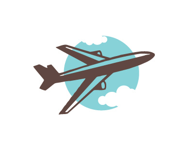

# Fetch in Flight


[ ](https://www.npmjs.com/package/fetch-in-flight)

> (Saving your users some flight time)

<p align="center">
    
</p>

## Motivation

Prevent multiple requests to the same resource at the same time, this is a Universal tool
and can be used Server Side or on the Client

## Install

```bash
npm install fetch-in-flight --save
```

## Usage
